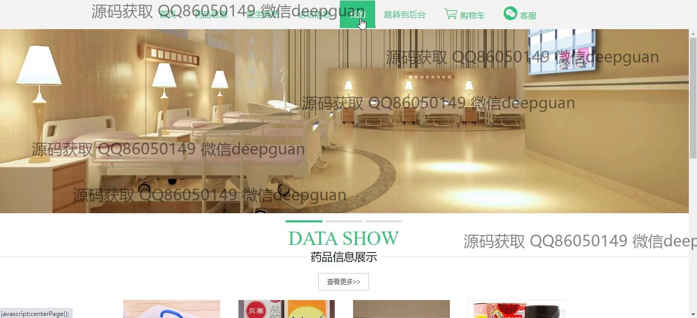
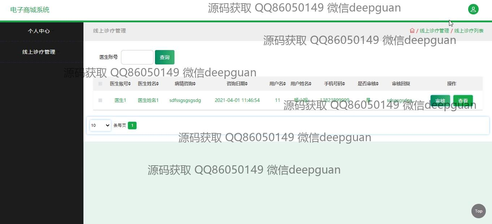
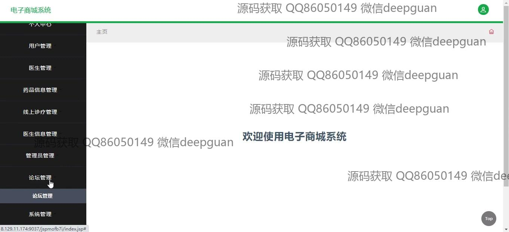

<h1 align="center">的电子药品商城系统</h1>

## 简介
电子药品商城系统：角色分为管理员、用户；主要功能包括用户管理、医生管理、药品信息管理、在线诊疗、订单处理、论坛交互、客户服务和多种支付接口。    --计算机毕业设计源码；毕设源码；java毕业设计源码

## 联系方式

<h3 align="center">获取完整代码与数据库文件 + 微信：deepguan QQ: 86050149 QQ群: 783742310</h3>

<h3 align="center">可帮忙远程部署 包运行成功！提供远程部署、修改代码、设计文档指导、代码讲解等服务！</h3>

## 功能介绍（完整见运行截图）
管理员：提供用户管理、医生管理、药品信息管理、订单管理、线上诊疗管理、论坛管理、系统管理等功能。可对用户信息、医生信息、药品信息进行新增、修改、删除操作，并支持订单状态的更新与发货处理。管理员还可以管理论坛问答内容和系统通知，确保商城的正常运行。

用户：支持注册、登录、退出等基础功能。可通过导航栏访问药品信息、医生信息、论坛信息等模块。用户可浏览药品详情并添加至购物车，进行在线支付和订单追踪。个人中心提供信息修改、地址管理和订单查询功能，还可与客服实时沟通或参与论坛讨论。

医生：展示医生的基本信息，包括姓名、年龄、从业时间、擅长领域及个人简介。医生可通过线上诊疗模块接收用户咨询并进行回复。系统支持按医生账号查询诊疗记录，便于医生和用户进行高效沟通与管理。

游客：无需注册即可浏览商城首页和药品信息，查看医生简介和论坛内容。游客可通过搜索框快速查询药品详情，但购买和线上诊疗等功能需登录后使用。系统设计为游客提供直观简洁的访问体验，鼓励其注册使用更多功能。

## 运行截图

本代码来源于网络,仅供学习参考使用!

